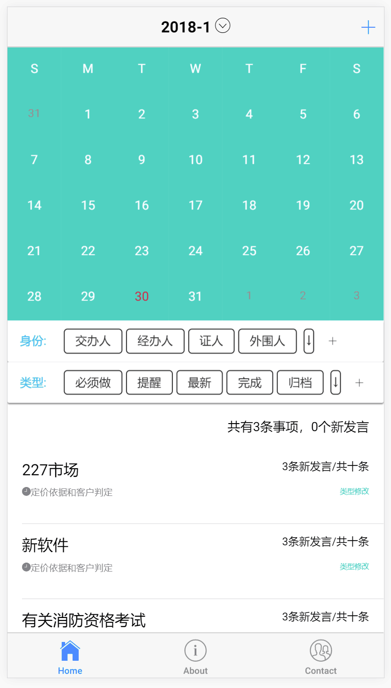

# calendar-date-picker
An ionic page contains monthly and weekly date-picking abilities written using javascript.

#configuration
ionic -3.19
Angular -4

## Installation
First of all, making sure you have installed [Nodejs](https://nodejs.org/en/) and Ionic

### Getting Started
If you haven't install Ionic, run the following code to install
```console
npm install -g ionic
```
run the following code to assure you have installed correctly and check its version:
```console
ionic -version
```
run the following code to install node-sass which results in the foler `node_modules`:
```console
cnpm install node-sass
```
if you don't have cnpm installed, google or check my [github blog](https://hardi-xu.github.io/) to find solutions.

## Run
```console
ionic serve
```
## Demo
You can click and change the date and mode as you wish.

### Week
<div align=center></div>

### Month
<div align=center></div>
